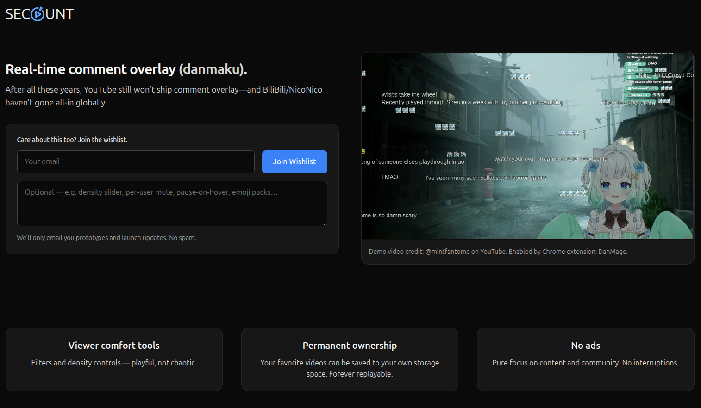

# DanMage

## Overview

DanMage is a project that brings NicoNico-style flow chat (A.K.A., scrolling chat, danmaku, danmu) to multiple video sites as both [a chrome extension](https://chrome.google.com/webstore/detail/danmage/elhaopojedichjdgkglifmijgkeclalm) and [a firefox extension](https://addons.mozilla.org/en-US/firefox/addon/danmage), now supporting YouTube, Twitch and Crunchyroll. It's also deployed as a [website](https://www.danmage.com/), which provides minimum backend support to the extension, such as storing posted chats and player settings.

It's definitely not perfect. The DOM tree is completely and not easy to parse. YouTube & Twitch etc. can introduce changes anytime without notifying me.

So if you want to see danmaku being built into a native video platform, wish list [here](https://www.secount.com/danmaku).

## Deployment

It's deployed to Google Cloud Platform (GCP) by using [Google Cloud Build](https://cloud.google.com/build) using `cloudbuild.yaml` and `Dockerfile`.

## Build

You can build the extension locally by `npm run ext_linux`, which dumps the bundled JS files into `./chrome_extension_bin` directory, which can be loaded in debug mode in browsers. It talks directly to the PROD web server.

You can do so for firefox with `npm run ext_firefox_linux_zip`.

If you want to build it for Windows/MacOS, you gotta do some work youself :)

## Version

### Version 5.3.0

Added a show/hide YouTube chat window option in the display settings tab, which is only needed on YouTube. Twitch and Kick can hide chat using their own buttons without disrupting danmaku. As a result, the button to open settings panel is relocated to the bottom of video players on all platforms.

### Version 5.2.1

Fixed small issues on Kick, including danmaku appearing mid screen on large screen, and sometimes timestamp is not removed. Though still easy to break whenver Kick updates their UI.

### Version 5.2.0

Supported Kick live streaming platform. Updated danmaku styling for YouTube.

### Version 5.1.0

Added support for 7tv extension on Twitch. Small refactors on extrating and applying styles to danmaku HTML elements.

### Version 5.0.1

Huge bump of library versions, which breaks the authentication on old extension unfortunately. Please update if you want to log in and load player settings. Otherwise the old extension works fine on its own.
